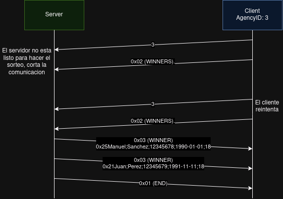

# TP0: Docker + Comunicaciones + Concurrencia

## Parte 1

### Ejercicio 1
Para ejecutar el ejercicio 1, simplemente se debe ejecutar el comando

```bash
make docker-compose-up
```

Esto ejecutara el docker-compose y creara los contenedores respectivos. Para verificar que haya un cliente nuevo, podemos ver los logs usando:

```bash
make docker-compose-logs
```

#### Ejercicio 1.1
En el directorio `ejercicio_1` hay un script de Python llamado `main.py`. Este script genera un archivo `docker-compose-ej-1.yaml`. Para correrlo, se usa de la siguiente manera:

```bash
python3 main.py <CANTIDAD_DE_CLIENTES>
```

Esto genera un archivo de configuracion docker compose con la cantidad de clientes ingresada. Finalmente para ejecutar dicho archivo y corroborar que la cantidad de clientes sea correcta, se pueden repetir los mismos comandos del ejercicio 1, pero con una pequeña diferencia en el nombre:

```bash
make docker-compose-up-ej-1
make docker-compose-logs-ej-1
```

De esta forma, se levantan los contenedores indicados en el archivo de configuracion `docker-compose-ej-1.yaml`. Para detener estos contenedores, se puede usar el comando `make docker-compose-down-ej-1`.


### Ejercicio 2
Para verificar el correcto funcionamiento del ejercicio 2, basta con ejecutar alguno de los archivos de configuracion `docker-compose.yaml` para levantar los contenedores. Verificar el correcto funcionamiento de los mismos mediante los logs o `docker ps -a` (verificando que el codigo de salida sea 0).

Luego, es posible modificar los archivos de configuracion `client/config.yaml` o `server/config.ini`. Por ejemplo, si el servidor sigue corriendo con la configuracion inicial, y se vuelve a ejecutar algun contenedor de cliente pero habiendo cambiado la configuracion en `client/config.yaml` por:
```yaml
# cliente (configuracion nueva)
server:
  address: "server:12344"
loop:
  lapse: "0m20s"
  period: "5s"
log:
  level: "info"
  ```

```ini
# servidor (configuracion inicial)
[DEFAULT]
SERVER_PORT = 12345
SERVER_IP = server
SERVER_LISTEN_BACKLOG = 5
LOGGING_LEVEL = INFO
```

Al no coincidir los puertos, el cliente deberia arrojar un error. Para probarlo, se puede levantar el contenedor del cliente con el comando:
```bash
docker start <ID_CONTENEDOR>
```

Luego, solo resta verificar los logs o el codigo de salida (mediante `docker ps -a`) del cliente para ver si los cambios surtieron efecto.


### Ejercicio 3
En la carpeta de `ejercicio_3` se encuentra todo lo necesario para verificar si el servidor esta ejecutandose. El primer paso es ejecutar el script `build_image.sh`, el cual construye la imagen que se usara para realizar la verificacion. 

Una vez ejecutado dicho script, tan solo resta ejecutar `run_container.sh`. Este script levanta el contenedor, el cual, usando netcat, envia el mensaje `"ping"` al servidor. 

El servidor, al ser un EchoServer, responde con el mismo mensaje. Si la respuesta recibida es igual a `"ping"`, entonces la verificacion ha tenido exito. En caso contrario, se imprimira un mensaje indicando que hubo un error.


### Ejercicio 4
Para verificar que el *graceful shutdown* funcione bien, hace falta levantar los contenedores usando `make docker-compose-up`. Una vez que se esten ejecutando, es posible verificar los logs con el comando `make docker-compose-logs`.

En otra terminal, hay que ejecutar `make docker-compose-down` para enviar la señal `SIGTERM`. Al recibirla, cada contenedor hara un graceful shutdown, el cual se ve detallado en los logs.


## Parte 2

### Ejercicio 5

Los paquetes del protocolo que implementé se ven asi:
| Longitud | ID Agencia | ; | Nombre | ; | Apellido | ; | Documento | ; | Nacimiento | ; | Numero | 
|----------|------------|---|--------|---|----------|---|-----------|---|------------|---|--------|

El campo de **Longitud** es un numero entero sin signo de 8 bits que indica la longitud total del paquete en bytes (desde el campo **ID Agencia** hasta el campo **Numero**). Es decir, para recibir un paquete, es necesario leer el primer byte para saber su longitud. Usando esta informacion, se lee mas bytes del socket hasta alcanzar la longitud indicada.

El resto de campos vienen como texto, siendo estos de tamaño variable. Por lo tanto, los campos estan delimitados usando el caracter **";"**. Una vez leidos todos los bytes de la "apuesta", se transforma en `string` y se separa acorde al delimitador mencionado previamente. Una vez que el servidor recibe la apuesta, envia `"OK"` al cliente para confirmar la recepcion.

Para ejecutar el programa, simplemente hay que correr `make docker-compose-up` para levantar los contenedores y `make docker-compose-log` para ver los logs que indican el envio y recibo de los paquetes. 


Un detalle importante es que el tamaño maximo que puede tener un paquete es 255 bytes de longitud para la parte de campos variables, mas un byte que denota la longitud misma. Esto resulta en un tamaño maximo de 256 bytes.

### Ejercicio 6

Decidi modificar el protocolo para este ejercicio. La comunicacion inicia del lado del cliente, quien envia el ID de la agencia. Despues de enviar dicho ID, el cliente envia, de a batches, las apuestas al servidor. El formato de estos batches es el siguiente:

| Longitud del batch | Longitud apuesta 1 | Apuesta 1 | Longitud apuesta 2 | Apuesta 2 | ... |
|--------------------|--------------------|-----------|--------------------|-----------|-----|

La longitud del batch indica la longitud (en bytes) del batch. Esta expresada en un enterno sin signo de 32 bits, por lo que el servidor primero lee dicho numero para saber cuantos bytes debe leer y obtener todo el batch.


El tamaño del batch es de 32 apuestas por defecto, aunque puede ser modificado desde el archivo de config.yaml. El valor por defecto lo calcule usando el tamaño maximo teorico de una apuesta, que debido al protocolo implementado es de 256 bytes (255 bytes para datos y 1 byte para la longitud). Debido a que el requisito es que no se superen los 8kB por batch, entonces simplemente divido los 8kB por la longitud maxima de una apuesta (256 bytes), lo que da por resultado 32 apuestas por batch.

Para ejecutar este ejercicio, solo hace falta correr `make docker-compose-up` y ver los logs con `make docker-compose-log`. Es recomendable redirigir el output a un archivo de texto para poder leer los logs con mayor facilidad ya que suelen ser muy extensos. Para ello, se puede ejecutar el comando `make docker-compose-log > logs.txt`

### Ejercicio 7

Nuevamente, en este ejercicio decidi realizar unas pequeñas modificaciones al protocolo. En primer lugar, agregue un campo mas al paquete. La estructura nueva es la siguiente:

| Tipo de mensaje | Datos del mensaje (opcional) |
|-----------------|------------------------------|

El tipo de mensaje es un entero sin signo de 8 bits y puede valer:
+ `0`: Indica que el mensaje es de tipo `BET`. Este mensaje es usado para transmitir apuestas en batches.
+ `1`: Indica que el mensaje es de tipo `END`. Este mensaje es usado para notificar que no se tiene mas informacion para transmitir.
+ `2`: Indica que el mensaje es de tipo `WINNERS`. Este mensaje es enviado por el cliente al servidor para pedir los ganadores del sorteo. Si el sorteo no puede realizarse aun, el servidor corta la conexion con el cliente. Es responsabilidad de este ultimo esperar un periodo (configurable en `config.yaml` mediante `winner.period`) para reenviar dicho mensaje.
+ `3`: Indica que el mensaje es de tipo `WINNER`. Este mensaje es enviado por el servidor al cliente para informarle de un ganador del sorteo. Tiene el mismo formato que una apuesta individual, es decir, sin batches.

La comunicacion se veria algo asi:


Una vez el cliente envia todas las apuestas, procede a la fase de consulta de ganador. El servidor solo puede responder a un mensaje `WINNERS` una vez que las 5 agencias hayan enviado sus apuestas.



Para ejecutar este ejercicio, se deben seguir los siguientes pasos:
1. Lo primero es generar un docker-compose con 5 agencias. Para ello, modifique el script del ejercicio 1, de forma que solo hace falta correr `python3 ./ejercicio_1/main.py 5`. El resultado de esto deberia ser un archivo llamado `docker-compose-ej-1.yaml`.
2. Una vez creado el `docker-compose-ej-1.yaml`, se puede levantar usando `make docker-compose-up-ej-1`.
3. Cuando los contenedores se esten ejecutando, se puede volcar los logs a un archivo de salida con `make docker-compose-logs-ej-1 > output.txt`.
4. Buscar los mensajes del tipo `action: consulta_ganadores | result: success | cant_ganadores: <CANTIDAD>` en los logs para verificar el correcto funcionamiento del programa.


## Parte 3

### Ejercicio 8

En este ejercicio, hice uso de la libreria `multiprocessing` para procesar mensajes en paralelo. No fue posible hacerlo con `multithreading` ya que Python posee un lock global del interprete (GIL), el cual no permite que se ejecuten instrucciones de forma concurrente usando threads.

Para poder lograr el procesamiento concurrente, por cada conexion entrante, creo un proceso nuevo el cual se encarga de recibir y enviar informacion al cliente. Sin embargo, esto resulta en que hay una seccion critica en las funciones encargadas de leer y escribir al archivo de apuestas. Como consecuencia, use un `Lock()` de `multiprocessing`, el cual permite que solo un proceso acceda a dicho recurso a la vez.

Asimismo, implemente una `Queue()` de `multiprocessing` para comunicar, al proceso principal, que clientes terminaron de transferir las apuestas. Este proceso principal es aquel que acepta conexiones nuevas. Despues de aceptar una conexion, lee la `Queue()` y actualiza el conjunto de notificaciones recibidas.

Finalmente, para el modifique el graceful shutdown para enviar un `SIGTERM` a todos los subprocesos. Al recibirlo, cada uno de estos realiza un graceful shutdown de forma independiente.

Para ejecutar este ejercicio, se pueden seguir los mismos pasos que para el ejercicio 7:
1. Lo primero es generar un docker-compose con 5 agencias. Para ello, modifique el script del ejercicio 1, de forma que solo hace falta correr `python3 ./ejercicio_1/main.py 5`. El resultado de esto deberia ser un archivo llamado `docker-compose-ej-1.yaml`.
2. Una vez creado el `docker-compose-ej-1.yaml`, se puede levantar usando `make docker-compose-up-ej-1`.
3. Cuando los contenedores se esten ejecutando, se puede volcar los logs a un archivo de salida con `make docker-compose-logs-ej-1 > output.txt`.
4. Verificar que los mensajes de `action: apuestas_almacenadas | result: success | client_id: <CLIENT_ID> | apuestas: [...]` estan intercalados, con IDs de clientes distintos.